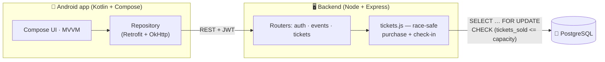

<div align="center">

# 🎟️ Eventix

### Event Ticketing Platform — sells out, never oversells

*A native **Android** app (Kotlin + Jetpack Compose) backed by a **Node.js + PostgreSQL** API that sells limited tickets **without ever overselling under concurrency** — proven by a load test that fires 200 purchases at 50 seats and lands exactly 50 sales.*

<br/>

[](https://kotlinlang.org/)
[](https://developer.android.com/jetpack/compose)
[](https://nodejs.org/)
[](https://expressjs.com/)
[](https://www.postgresql.org/)
[](https://jwt.io/)

[](LICENSE)


</div>

---

## 📖 Overview

**Eventix** is a full-stack event-ticketing product built around one hard problem:
**selling a limited number of tickets without ever overselling**, even when
hundreds of buyers tap *Buy* at the same instant.

- 🖥️ **Backend** — a Node.js + Express + PostgreSQL REST API. The purchase path is
  the star: a pessimistic row lock, a database `CHECK` constraint, and idempotency
  keys combine so that **exactly the right number of tickets sell — no more.**
- 📱 **Android app** — a premium, 100%-Kotlin **Jetpack Compose** app: event
  discovery with live seats-left, one-tap idempotent purchase, a signed-QR ticket
  wallet, and a **CameraX + ML Kit check-in scanner** for organizers.

> **The one-liner:** two buyers read *"1 seat left"* and both try to buy — Eventix
> serializes them on a `SELECT … FOR UPDATE` row lock so exactly one wins, backs it
> with a `CHECK (tickets_sold <= capacity)` constraint, and ships an executable load
> test that proves it: **200 concurrent buyers, 50 seats, exactly 50 sales.**

<div align="center">

**🔑 Demo accounts** &nbsp;·&nbsp; Attendee `attendee@demo.com` &nbsp;·&nbsp; Organizer `organizer@demo.com` &nbsp;·&nbsp; both `password123`

</div>

---

## 🏛️ Architecture at a glance

> This is a monorepo with **no web frontend** — the API's only client is the Android app.



---

## 🏁 The flagship — race-condition-safe ticket sales

Overselling is the classic ticketing bug. Eventix closes it with **three
independent layers**, so even a regression in one is caught by the next:

```mermaid
sequenceDiagram
  participant A as Buyer A
  participant B as Buyer B
  participant API as tickets.js
  participant DB as PostgreSQL

  A->>API: POST /events/42/purchase
  B->>API: POST /events/42/purchase
  API->>DB: BEGIN; SELECT … FOR UPDATE (event 42)
  Note over DB: A locks the row;<br/>B waits on the same row
  API->>DB: check capacity + INSERT ticket + tickets_sold++
  API->>DB: COMMIT (lock released)
  Note over DB: B resumes, sees new count
  API-->>B: 409 SOLD_OUT
```

| # | Layer | Guarantees |
|:-:|-------|-----------|
| 1 | **Pessimistic row lock** — `SELECT … FOR UPDATE` on the event row | Buyers for the same event queue up; capacity check + increment are atomic. Different events lock different rows, so unrelated sales never block. |
| 2 | **DB-level `CHECK (tickets_sold <= capacity)`** | Defense in depth — the database itself refuses to oversell, even if app code regressed. |
| 3 | **Idempotency key** — `UNIQUE` constraint on `purchases` | A retried tap never buys two tickets; a replay returns the original ticket. |

Two more races are closed the same way:
- **Double check-in** — a single conditional `UPDATE … WHERE status = 'valid'` means one scanner wins and the other gets *"Already checked in"*. The row update *is* the mutex.
- **Unforgeable QR** — tickets are `ETP1.<code>.<HMAC-SHA256(code, secret)>`, verified server-side with a timing-safe comparison.

> 📐 Full walkthrough + the pool-starvation "war story" in **[`docs/ARCHITECTURE.md`](docs/ARCHITECTURE.md)**.

### ✅ Proof, not claims

The repo ships an **executable spec** — no screenshots required:

```bash
cd backend
npm run loadtest     # 50-seat event, 200 simultaneous purchase requests
```

```
Expected result
────────────────────────────────────────────────
✓ exactly 50 purchases succeed
✓ 150 return SOLD_OUT
✓ all ticket codes are unique
✓ idempotent retry returns the original ticket
✓ a double check-in of the same QR is rejected
```

---

## ✨ Features

### 📱 Android app (Eventix)
- **Discover** — searchable event list, pull-to-refresh, **live seats-left chips** (green / amber "Only N left" / red "Sold out"), cover images.
- **Event detail** — hero image, an **availability progress bar** (sold vs capacity), and an **idempotent Buy** with a success dialog → *View ticket*.
- **Tickets wallet** — purchased tickets as cards, each rendering an on-device QR (forced black-on-white), with VALID / USED status chips.
- **Organizer scanner** — CameraX live preview + ML Kit QR detection, a camera-permission gate, and an in-flight guard so one QR triggers exactly one check-in. Colored result cards: *Welcome!* / *Already checked in* / *Wrong event* / *Invalid*.
- **Create event** — organizer form with date/time picker, price, capacity, cover URL, client-side validation.
- **Auth** — one screen toggling sign-in / register with a **role picker** (Attendee vs Organizer).

### 🖥️ Backend API
- Race-safe purchase, atomic check-in, computed `seatsLeft`, JWT auth, role-gated organizer routes.
- **Near zero-config:** a real PostgreSQL is bundled via npm (`embedded-postgres`) and boots automatically — or set `EMBEDDED_PG=0` to use Docker.
- Schema + demo data applied automatically on first boot.

---

## 📱 The App, Screen by Screen

| Screen | Who | What it does |
|--------|-----|--------------|
| **Splash** | all | Brand-gradient splash while the saved JWT session loads. |
| **Auth** | all | Sign-in / register toggle, role picker, password show/hide, inline validation, demo-account hint. |
| **Discover / Home** | all | Search by title/venue, pull-to-refresh, live seats-left chips, price chips, cover images. |
| **Event Detail** | all | Hero, availability bar, sticky price + idempotent Buy, success dialog. |
| **Tickets Wallet** | attendee | On-device signed QR cards, VALID / USED chips, empty state. |
| **Scanner** | organizer | CameraX + ML Kit scanning, in-flight guard, colored result cards, haptics. |
| **Create Event** | organizer | Title, venue, date/time, price (₹), capacity, cover URL; publishes to the API. |

> 🧭 **Role-based navigation:** attendees see Discover + Tickets; organizers additionally see Scan + Create — the bottom nav is built from the logged-in user's role.

---

## 🛠️ Tech Stack

| Layer | Technology |
|-------|-----------|
| **Mobile** | Kotlin · Jetpack Compose · Material 3 · MVVM + StateFlow |
| **Networking** | Retrofit · OkHttp · kotlinx-serialization · DataStore (JWT) |
| **Camera / QR** | CameraX · ML Kit barcode scanning · ZXing (on-device QR generation) |
| **Backend** | Node.js 20+ · Express 4 · PostgreSQL (embedded or Docker) |
| **Security** | JWT auth · bcrypt · HMAC-SHA256 signed QR · timing-safe verification |
| **Validation** | Zod |
| **Testing** | Custom concurrency load test (200 buyers · 50 seats) |

---

## 🚀 Getting Started

### 1. Run the backend

**Requirements:** Node.js 20+ (nothing else — PostgreSQL is bundled via npm and starts automatically).

```bash
git clone https://github.com/bhanu87777/Eventix-Event-Ticketing-Platform.git
cd Eventix-Event-Ticketing-Platform/backend

cp .env.example .env     # dev defaults work out of the box
npm install
npm run dev              # boots embedded Postgres + API on http://localhost:3000
```

First boot creates the schema and seeds demo data (accounts above).

> Prefer Docker? Set `EMBEDDED_PG=0` in `backend/.env` and run `docker compose up -d` first — the schema applies automatically on server start.

**Prove the concurrency handling** (second terminal, server running):

```bash
cd backend
npm run loadtest         # 200 purchases → exactly 50 succeed, 150 SOLD_OUT
```

### 2. Run the Android app on your phone

One-time: enable **USB debugging** (Settings → About phone → tap **Build number** ×7 → Developer options → USB debugging), plug in via USB, accept the prompt. Then, with the backend running:

```powershell
$env:PATH += ";$env:LOCALAPPDATA\Android\Sdk\platform-tools"
adb devices                          # phone listed as "device"
adb reverse tcp:3000 tcp:3000        # tunnels phone's localhost:3000 to your laptop over USB
adb install android\app\build\outputs\apk\debug\app-debug.apk
```

Open **Eventix** and sign in with a demo account. To rebuild after changes:

```powershell
cd android
.\gradlew.bat assembleDebug
adb install -r app\build\outputs\apk\debug\app-debug.apk
```

> **Android Studio (recommended for editing):** open the `android/` folder and press Run ▶ — it reuses the SDK at `%LOCALAPPDATA%\Android\Sdk`.
> `adb reverse` must be re-run after replugging USB or restarting adb.

### 3. Demo walkthrough

1. Sign in as **attendee@demo.com** → browse → open an event → **Buy ticket** → **View ticket** shows the QR in your wallet.
2. Sign out, sign in as **organizer@demo.com** → **Scan** tab → point the camera at the attendee's QR → green *Welcome!* card.
3. Scan the same QR again → red *Already checked in* — the double-entry race is closed.
4. Run `npm run loadtest` while watching an event's "seats left" bar in the app — it drops to Sold out with exactly **0** overselling.

---

## 📁 Project Structure

```
Eventix-Event-Ticketing-Platform/
├── backend/                    # Node.js + Express + PostgreSQL API
│   ├── src/
│   │   ├── index.js            # app bootstrap, routers, error handler
│   │   ├── db.js               # pool + embedded Postgres + migration on boot
│   │   ├── auth.js             # register / login (bcrypt + JWT)
│   │   ├── events.js           # list/search/create events (computed seatsLeft)
│   │   ├── tickets.js          # ⭐ race-safe purchase + atomic check-in
│   │   └── seed.js             # demo accounts + events
│   ├── migrations/001_init.sql # schema incl. no_oversell CHECK + unique keys
│   ├── loadtest/oversell-test.js # executable concurrency spec
│   ├── docker-compose.yml
│   └── .env.example
├── android/                    # Kotlin + Jetpack Compose app "Eventix"
│   └── app/src/main/java/com/etp/app/
│       ├── data/               # Api · Repository · Models · Session (JWT)
│       ├── ui/screens/         # Auth · Home · EventDetail · Tickets · Scanner · CreateEvent
│       ├── ui/theme/           # violet Material 3 design system
│       ├── util/               # Qr (ZXing) · Format
│       └── MainActivity.kt · EtpApplication.kt (manual DI)
├── docs/
│   ├── ARCHITECTURE.md         # deep dive + sequence diagrams + war story
│   ├── Eventix_1_Features_Walkthrough.pdf
│   └── Eventix_2_Codebase_Guide.pdf
├── LICENSE
└── README.md
```

---

## 🔌 API Reference

| Method | Path | Auth | Purpose |
|---|---|---|---|
| `POST` | `/auth/register` | — | Create account (`attendee` or `organizer`) |
| `POST` | `/auth/login` | — | Get JWT |
| `GET` | `/events?q=` | user | List / search events with `seatsLeft` |
| `GET` | `/events/:id` | user | Event detail |
| `POST` | `/events` | organizer | Create event |
| `POST` | `/events/:id/purchase` | user + `Idempotency-Key` | Race-safe ticket purchase |
| `GET` | `/me/tickets` | user | Ticket wallet |
| `POST` | `/checkin` | organizer | Atomic QR check-in |

---

## 🔭 Future Improvements

- [ ] **Real payments** — Stripe / Razorpay with a payment-intent before ticket issuance
- [ ] **iOS app** — a SwiftUI client against the same API
- [ ] **Organizer analytics** — sales over time, check-in rate, revenue per event
- [ ] **Waitlist & resale** — auto-offer freed seats when a ticket is refunded
- [ ] **Push notifications** — event reminders and "back in stock" alerts (FCM)
- [ ] **Seat maps** — reserved seating for venues, not just general admission
- [ ] **Hilt DI + UI tests** — swap manual DI for Hilt; add Compose UI + backend integration tests

---

## 🤝 Contributing

Contributions, issues, and feature requests are welcome!

1. Fork the project
2. Create your feature branch (`git checkout -b feature/amazing-feature`)
3. Commit your changes (`git commit -m 'Add amazing feature'`)
4. Push to the branch (`git push origin feature/amazing-feature`)
5. Open a Pull Request

---

## 📄 License

Distributed under the **MIT License**. See [`LICENSE`](LICENSE) for details.

---

## 👤 Author

**Bhanu Prakash M**

[](https://github.com/bhanu87777)

> 💡 If Eventix helped or impressed you, consider giving the repo a ⭐ — it genuinely helps!

<div align="center">
<sub>Built with Kotlin, Jetpack Compose, Node.js, and PostgreSQL — and a load test that refuses to oversell.</sub>
</div>
