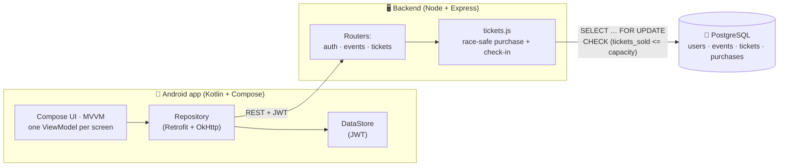

# 🏗️ Eventix — Architecture

A monorepo with two halves and **no web frontend** — the API's client is the
native Android app.

```
Event Ticketing Platform/
├── backend/   Node.js + Express + PostgreSQL API   (the concurrency showcase)
└── android/   Kotlin + Jetpack Compose app "Eventix"
```

---

## 1. System overview



The Android client talks to the REST API over HTTP with a JWT bearer token
(injected by an OkHttp interceptor). Every mutation that can race is resolved
**server-side, in the database** — the client never arbitrates correctness.

---

## 2. The flagship — race-condition-safe ticket sales

Overselling is the classic ticketing bug: two requests both read *"1 seat left"*
and both succeed. Eventix defends against it in **three independent layers**, so
even a regression in one is caught by the next.

```mermaid
sequenceDiagram
  participant A as Buyer A
  participant B as Buyer B
  participant API as tickets.js
  participant DB as PostgreSQL (event row)

  A->>API: POST /events/42/purchase (Idempotency-Key: k1)
  B->>API: POST /events/42/purchase (Idempotency-Key: k2)
  API->>DB: BEGIN; SELECT … FOR UPDATE (event 42)
  Note over DB: A acquires the row lock;<br/>B blocks on the same row
  API->>DB: capacity check + INSERT ticket + tickets_sold++
  API->>DB: COMMIT (lock released)
  Note over DB: B now proceeds — sees updated tickets_sold
  API->>DB: capacity check → SOLD OUT → 409
```

| # | Layer | What it guarantees |
|:-:|-------|--------------------|
| 1 | **Pessimistic row lock** — `SELECT … FOR UPDATE` on the event row inside the purchase transaction | Concurrent buyers for the *same* event queue on the lock, so the capacity check and the increment are atomic. Different events lock different rows, so unrelated sales never block. |
| 2 | **DB-level `CHECK`** — `CHECK (tickets_sold <= capacity)` (`no_oversell`) | Defense in depth: even if the application logic regressed, the database itself refuses to persist an oversell. |
| 3 | **Idempotency key** — a `UNIQUE` constraint on `purchases.idempotency_key` | A timed-out client that retries can never be sold two tickets; a replay returns the original ticket, and when two retries race the constraint picks exactly one winner. |

> **War story (a real bug this code fixes):** the first load-test run *deadlocked*
> the API. The purchase handler held a pooled connection in a transaction, then
> requested a **second** connection for a follow-up query. Under 200 concurrent
> requests all 20 pool slots were held, each waiting for a 21st — classic pool
> starvation. Fix: **reuse the transaction's connection** for the follow-up read.

---

## 3. Second race — double check-in

Two gate scanners scan the same ticket at once. Instead of a lock, a single
**conditional update** is the mutex:

```sql
UPDATE tickets SET status = 'checked_in', checked_in_at = now()
WHERE code = $1 AND status = 'valid';
```

Exactly one scanner matches the row (1 row updated → *"Welcome!"*); the other
matches zero rows → *"Already checked in"*. The row update itself is atomic — no
explicit lock needed.

---

## 4. Unforgeable QR codes

A ticket's QR payload is `ETP1.<code>.<HMAC-SHA256(code, TICKET_SECRET)>`. The
server re-computes the signature with a **timing-safe comparison** on check-in,
so codes can't be guessed or forged offline. QR bitmaps are generated on-device
(ZXing) and never stored as images.

---

## 5. Data model (`backend/migrations/001_init.sql`)

| Table | Purpose |
|-------|---------|
| `users` | Accounts with a `role CHECK (attendee / organizer)` and bcrypt password hash. |
| `events` | `capacity`, `tickets_sold`, price, venue — carries the `no_oversell` CHECK. |
| `tickets` | Unique `code`, `status CHECK (valid / checked_in)`, owner + event FKs. |
| `purchases` | One row per purchase attempt; `UNIQUE(idempotency_key)` makes retries idempotent. |

---

## 6. Backend layout (`backend/src/`)

| File | Responsibility |
|------|----------------|
| `index.js` | Boots Express, mounts `auth` / `events` / `tickets` routers + `/health`, central error handler, graceful shutdown. |
| `db.js` | PostgreSQL pool; boots **embedded Postgres** when `EMBEDDED_PG=1`, applies the migration on start. |
| `auth.js` | Register / login, bcrypt hashing, JWT issuance. |
| `events.js` | List/search events (computed `seatsLeft`), event detail, create event (organizer). |
| `tickets.js` | **The hot path** — race-safe purchase (row lock + idempotency) and atomic check-in. |
| `seed.js` | Seeds demo accounts + events on first empty boot. |
| `loadtest/oversell-test.js` | Executable spec: 200 parallel buyers, 50 seats, asserts exactly 50 sales. |

---

## 7. Android app (`android/app/src/main/java/com/etp/app/`)

- **UI:** Jetpack Compose + Material 3, dark/light theme, edge-to-edge, custom violet design system (`ui/theme/Theme.kt`). 100% Kotlin, no XML layouts.
- **Pattern:** MVVM — one ViewModel per screen exposing `StateFlow`; manual DI via `AppContainer` (`EtpApplication.kt`).
- **Networking:** Retrofit + OkHttp + kotlinx-serialization (`data/Api.kt`, `data/Repository.kt`); JWT in DataStore (`data/Session.kt`), injected by an OkHttp interceptor.
- **QR wallet:** ZXing renders the server-signed payload on-device (`util/Qr.kt`) — always black-on-white for scannability.
- **Scanner:** CameraX `ImageAnalysis` + ML Kit barcode scanning, with an in-flight guard so one QR triggers exactly one check-in (`ui/screens/ScannerScreen.kt`).
- **Navigation:** role-based graph (`ui/Nav.kt`) — attendees see Discover + Tickets; organizers additionally see Scan + Create, built from the logged-in user's role.

| Screen | File |
|--------|------|
| Auth (login/register + role picker) | `ui/screens/AuthScreen.kt` |
| Discover / Home (search, pull-to-refresh, live seats-left) | `ui/screens/HomeScreen.kt` |
| Event detail (availability bar, idempotent buy) | `ui/screens/EventDetailScreen.kt` |
| Tickets wallet (QR cards) | `ui/screens/TicketsScreen.kt` |
| Organizer scanner (CameraX + ML Kit) | `ui/screens/ScannerScreen.kt` |
| Create event (organizer) | `ui/screens/CreateEventScreen.kt` |
